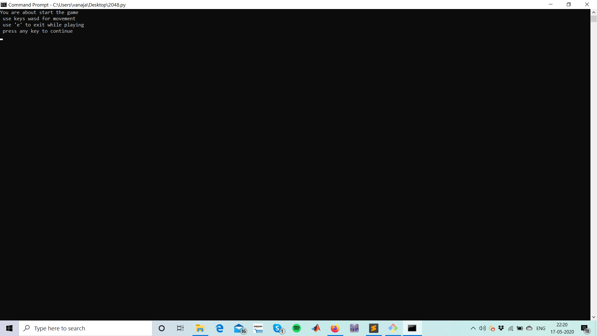

(Please note this python(3) file attached is only compatible with windows sys.Using other os probably wont give the desired output)
TASK- To program an effecient 2048 game without GUI in python(3)

BRIEF- This version of 2048 game works on the terminal with the use of WASD(wasd) keys. 
       It is dynamic ie user can enter the required board size(no inp then def size as 5) and winning value(def set at 2048)
       User can also exit the game by pressing E(e) and it will direct the user to the def prompt in the terminal

Playing  -  User is prompted with matrix of a given size(as enteres by user)  with a single randomly alotted 2
            User can play the game with W- to move the board up
the Game                               A- to move the board down
                                       S- to move the board left
                                       D- to move the board right
           the whole board (rows or coloumns) moves the respective direction as entered by the user.Every time there is valid move a random 2 is inserted in the matrix
           if there are multiples of to on either of the side pushing the required key would merge them and double the number.
           if the board cant move on any side it will prompt the user with "try again"

Winning-  the aim is to reach the winning value(as entered by the user) by pressing the requied keys
Losing -  the user loses the game if there are no spaces left and no valid moves to play ie to merging possible
exit-     User can exit by pressing E(e) while playing

Algorithm- The code for the game consists of certain comments so that one can understand the different aspects of the code.

<video src="imgs/video%20illus.mp4" width="320" height="200" controls preload></video>

